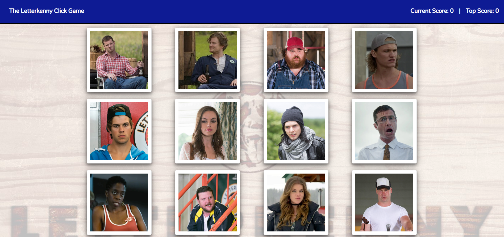

# The Letterkenny Click Game

There may be 5000 people in Letterkenny, but you only have to remember 12! 

Test your memory by clicking each of the character cards only once.  After each successful attempt, your score will increment by one and the cards will shuffle positions. If you click a character twice, the score will reset and you can try again. The goal is to select all 12 without any repeats.

## Demo

A demo of this application can be found on Heroku at https://letterkennyclick.herokuapp.com/

**Desktop Application View**\

## Resources

This project was created with React utilizing the create-react-app npm package

## Disclaimer
This application is in no way associated with Letterkenny and is for entertainment and educational purposes only.
